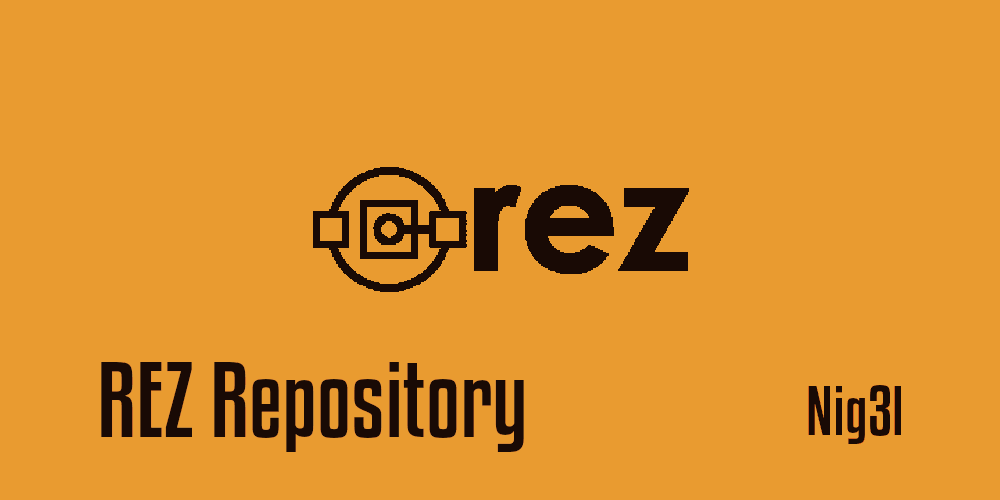

# Rez Command Extension : rez-repository

Handle Rez package repositories directly from CLI.



This project was bootstrapped with [Rez Init](https://github.com/Ni-g-3l/rez-init).

## 📤 rez-repository command

Rez repository help you to handle Rez package repositories directly from CLI.
You can add folder with : 

```bash
rez repository add <path_to_folder>
```
You can remove folder with : 

```bash
rez repository add <path_to_folder>
```
You can list all of repositories folder with : 

```bash
rez repository --list
```

You can exec them directly from terminal by using the following command : 
## ⚙️ Dev Commands

In the project directory, you can run :

### `make install`

Install Rez repository to your current rez environment.

### `make uninstall`

Uninstall Rez repository from your current rez environment.

### `make clean`

Remove all python run artefacts.

### `make test`

Launches the unittest test runner.

## 📥 Installation

1. Download latest version from [Release](https://github.com/Ni-g-3l/rez-repository/releases)
2. Install it with the following commands :

```bash
rez python -m pip install <path_to_wheel>
```

## 🔢 Versioning

We use [SemVer](http://semver.org/) for versioning. For the versions available, see the [tags on this repository](https://github.com/Ni-g-3l/rez-repository/tags).

## 🤹 Authors / Contributers / Attributions

See also the list of [contributors](https://github.com/Ni-g-3l/rez-repository/contributors) who participated in this project.

## 📃 License

This project is licensed under the MIT License - see the [LICENSE.md](LICENSE) file for details.

## 👏 Acknowledgments

* **Billie Thompson** - *README & Contribution Templates* - [PurpleBooth](https://github.com/PurpleBooth)

* **Ni-g-3l** - *Template Rez extension* - [Github](https://github.com/Ni-g-3l/)
